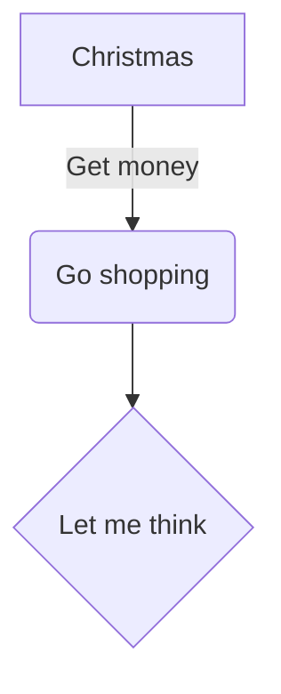

This is a test note!

This is pretty sick!

$$E=mc^2$$

```
This is a code block
```


```rust
fn my_function(param: String) -> String {
	if param.len() > 0 {
		"This is a string".to_string()
	} else {
		"This is a different string".to_string()
	}
}
```


1. Numbered list
2. item 2

- bullet list
- iten 2




![[Computer-memory-diagram.png#invert|300]]


> [!NOTE]- This is a callout
> Contents


| This | A     | x   |
| ---- | ----- | --- |
| is   | table | y   |

Horizontal rule:

---


This is body text

Link to heading in another note: [[Another Note#L2 Heading YAY!|here]]

#tag


Here is some html:

<center>Center text</center>

**Bold text**

*Italic text*

Link to note in a different folder: [[Note in Folder|here]]

